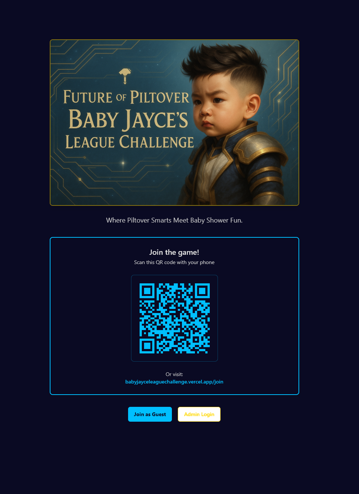
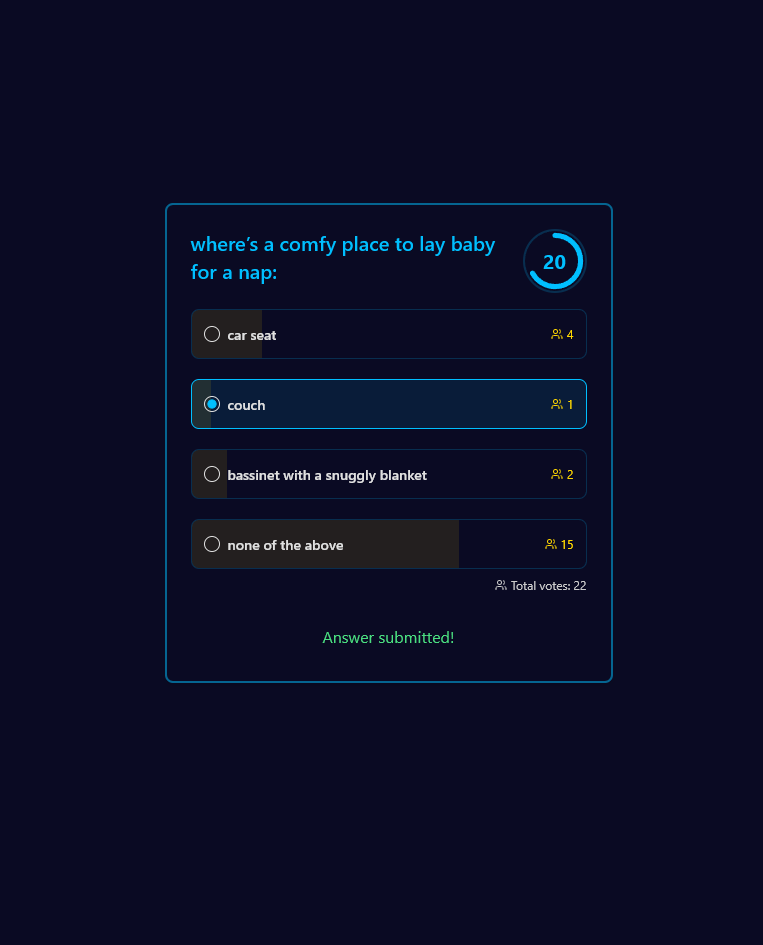

# Baby Shower Trivia Web App

A real-time interactive trivia game platform designed for mobile devices, perfect for events, parties, and gatherings. Players can join via QR code, answer questions, submit custom answers, and compete for the highest score.

## Screenshots

<table>
  <tr>
    <td align="center">
      <br/>
      <sub>Homepage with QR code</sub>
    </td>
    <td align="center">
      <br/>
      <sub>Trivia question</sub>
    </td>
    <td align="center">
      <br/>
      <sub>Image question</sub>
    </td>
  </tr>
  <tr>
    <td align="center">
      <br/>
      <sub>Results & Leaderboard</sub>
    </td>
    <td align="center">
      <br/>
      <sub>Admin Dashboard</sub>
    </td>
    <td></td>
  </tr>
</table>

---

## Features

- Real-time interaction using Pusher
- Multiple game support
- Custom answer submission
- Admin dashboard for game hosts
- Mobile-first responsive design
- QR code join for easy access
- Live player tracking
- Victory celebrations
- Flexible question types (with/without correct answers)
- Image questions
- Real-time leaderboard

## Tech Stack

- **Frontend:** Next.js 14 (App Router), React, TypeScript
- **Styling:** Tailwind CSS, shadcn/ui components
- **Database:** Supabase (PostgreSQL)
- **Real-time:** Pusher
- **Deployment:** Vercel (recommended)

## Getting Started

### Prerequisites
- Node.js 18+ and npm/yarn
- Supabase account
- Pusher account

### Installation

1. **Clone the repository**
   ```bash
   git clone https://github.com/yourusername/baby-shower-trivia-webapp.git
   cd baby-shower-trivia-webapp
   ```
2. **Install dependencies**
   ```bash
   npm install
   ```
3. **Copy environment variables**
   ```bash
   cp .env.example .env.local
   # Fill in your Supabase and Pusher credentials
   ```
4. **Run the app locally**
   ```bash
   npm run dev
   ```

### Database Setup
1. Create a new Supabase project
2. Run the migration scripts in `/sql` using Supabase SQL Editor or the admin dashboard

### Folder Structure
- `app/` - Next.js App Router pages
- `components/` - React components
- `hooks/` - Custom React hooks
- `lib/` - Utility functions
- `public/` - Static assets (including images)
- `sql/` - SQL migration scripts
- `types/` - TypeScript type definitions

## Contributing

Pull requests are welcome! For major changes, please open an issue first to discuss what you would like to change.

1. Fork the repository
2. Create your feature branch (`git checkout -b feature/your-feature`)
3. Commit your changes (`git commit -m 'Add your feature'`)
4. Push to the branch (`git push origin feature/your-feature`)
5. Open a Pull Request

## License

This project is licensed under the MIT License - see the [LICENSE](LICENSE) file for details.

## Acknowledgments
- [Next.js](https://nextjs.org/)
- [Supabase](https://supabase.io/)
- [Pusher](https://pusher.com/)
- [Tailwind CSS](https://tailwindcss.com/)
- [shadcn/ui](https://ui.shadcn.com/)
